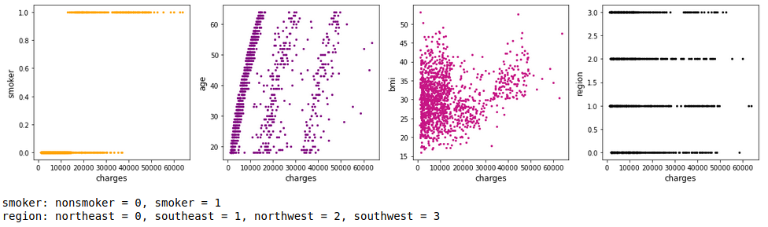
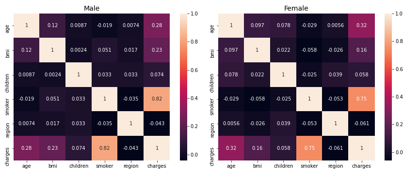
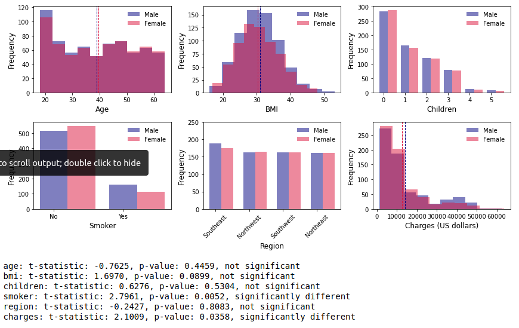
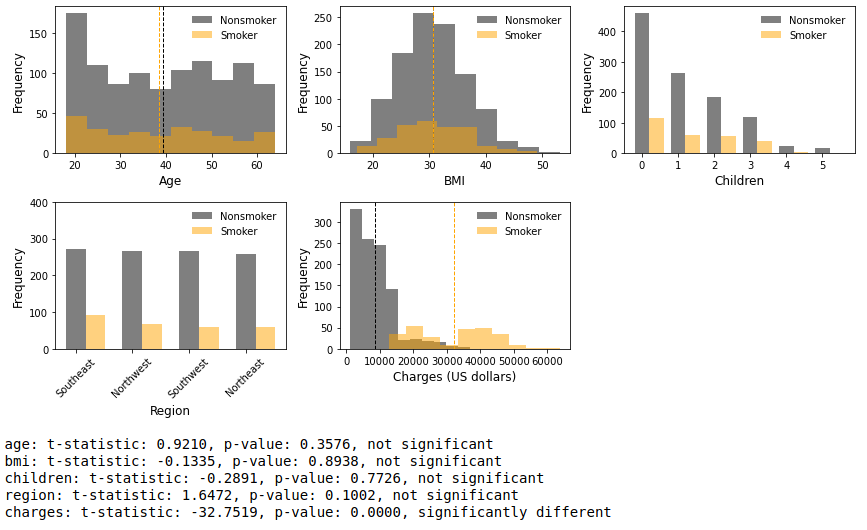
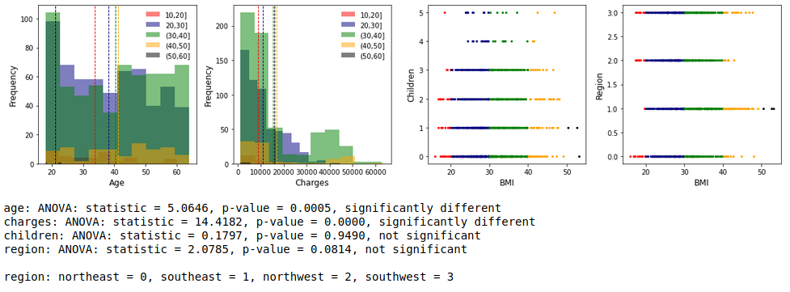

# capstoneProject1

## Aim:
The goal of this study is to investigate the medical cost personal dataset using multiple statistics approaches including hypothesis testing and regression analysis.  This dataset presents a yearly medical cost for individuals in United States, and is available at https://www.kaggle.com/mirichoi0218/insurance.

## Working Hypothesis:
I would like to test hypothesis whether there are difference between the medical insurance cost of (1) men and women, (2) smoker and nonsmoker, and (3) their body mass index (BMI) based on their personal information described in the dataset.

Null Hypothesis: 

H0 = 0

Alternative Hypothesis:

H1 ≠ 0

## Figures:

Gender:

Smoker:

BMI:

