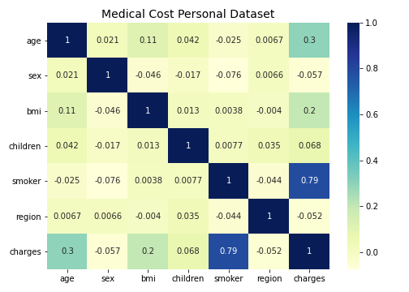
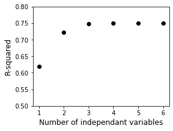

# Medical Insurance Expense

## Aim:
The goal of this study is to investigate the medical insurance cost dataset using multiple statistical approaches including hypothesis testing, correlation, and regression analysis.  This dataset presents a yearly medical cost for individuals in United States, and is available at https://www.kaggle.com/mirichoi0218/insurance.

## General Information:
Figure 1.  This dataset consists of seven feature columns: age, sex, BMI (body mass index, weight/height), children (dependents), region, and charges.  And their overall distribution are shown here.

age: mean: 39, number of male: 676, number of female: 662, bmi: mean: 30.7, number of nonsmoker: 1,064, number of smoker: 274, charge: max: 63,770, charge: min: 1,122, charge: mean: 13270

## Hypothesis Testing:
Test whether there are difference between the medical insurance cost of (1) men and women, (2) smoker and nonsmoker, and (3) body mass index (BMI) groups, (4) age groups, (5) children, and (6) regions.

Null Hypothesis: 

H0: µ = 0, the costs are statistically the same.

Alternative Hypothesis:

H1: µ ≠ 0, the costs are significantly different.

Figure 2.  Cost distribution within each category. α = 0.05. 

male: mean: 13,957, female: mean: 12,570

t-statistic: 2.1009, p-value: 3.58e-02, significantly different

nonsmoker: mean: 8,434, smoker: mean: 32,050

t-statistic: -32.7519, p-value: 5.89e-103, significantly different

(10,20]: mean: 8,839, (20,30]: mean: 10,850, (30,40]: mean: 15,380, (40,50]: mean: 16,810, (50,60]: mean: 16,034

ANOVA: statistic = 14.4182, p-value = 1.57e-11, significantly different

(20,30]: mean: 9,806, (30,40]: mean: 11,639, (40,50]: mean: 14,782, (40,50]: mean: 17,062, (50,60]: mean: 21,063

ANOVA: statistic = 25.1454, p-value = 5.30e-20, significantly different

none: mean: 12,366, one: mean: 12,731, two: mean: 15,074, three: mean: 15,355, four: mean: 13,851, five: mean: 13,851

ANOVA: statistic = 3.2969, p-value = 5.79e-03, significantly different

northeast: mean: 13,406, southeast: mean: 12,347, northwest: mean: 13,406, southwest: mean: 12,347

ANOVA: statistic = 0.9329, p-value = 4.24e-01, not significant

## Correlation Analysis:
 Correlation analysis is a statistical method used to test the strength of relationships between quantitative or categorical variables.  A high correlation coefficent means that the variables have a strong relationship; whereas a low correlation coefficent means that they are weakly related.  Positive and negative values indicate whether they are positively or negatively correlated.

Figure 3.  Correlation matrix of the entire dataset.

Figure 4.  Scatter plots of highly correlated variables.  Left panel: 0: nonsmoker, 1: smoker.

## Regression Analysis:
Regression analysis is a statistical method used to model the relationship between a dependent variable and one or more independent variables (or features):

Simple linear regression: y = a + bx

Multivariate linear regression: y = β0 + β1x1 + β2x2 + ... + βkxk + e

Figure 5.  Model evaluation.  The depedent variable is charges.  Features were ranked by correlation.  1: smoke, 2: smoke + age, 3: smoke + age + bmi, 4: smoke + age + bmi + children, 5: smoke + age + bmi + children + sex, 6: smoke + age  + bmi + children + sex + region.

## Summary:
This dataset shows that the medical costs vary depending on age, gender, body mass index, how many children they have, and whether or not they smoke.  A linear regression model having multiple highly correlated variables may improve the goodness-of-fit.  Future work may include Bayesian statistics to determine the probability of individual medical expense that falls within a cost range given specific conditions.

## Technologies:
Python, Numpy, Pandas, Scipy, Sckit-Learn, Matplotlib, Seaborn
